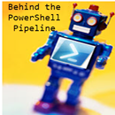

# Jeff Hicks

 I am a veteran IT Pro and scripting fanatic, going back to batch files in the early days of DOS. Today, I create content, code, and courses intended to teach PowerShell or to make an IT Pro's job a little easier. You can often find me speaking to user groups and at IT conferences like Techmentor. I blog frequently at <https://jdhitsolutions.com/blog>.

Here is a sample of my latest work:

<!-- BLOG-POST-LIST:START -->
- [My Conference Future](https://jdhitsolutions.com/blog/conferences/9327/my-conference-future/?utm_source=rss&utm_medium=rss&utm_campaign=my-conference-future)
- [PowerShell Refresh](https://jdhitsolutions.com/blog/powershell/9325/powershell-refresh/?utm_source=rss&utm_medium=rss&utm_campaign=powershell-refresh)
- [Module Linking](https://jdhitsolutions.com/blog/powershell/9323/module-linking/?utm_source=rss&utm_medium=rss&utm_campaign=module-linking)
- [Friday Fun with PSQuizzes](https://jdhitsolutions.com/blog/powershell/9260/friday-fun-with-psquizzes/?utm_source=rss&utm_medium=rss&utm_campaign=friday-fun-with-psquizzes)
- [Discover Enums with Get-TypeMember](https://jdhitsolutions.com/blog/powershell/9247/discover-enums-with-get-typemember/?utm_source=rss&utm_medium=rss&utm_campaign=discover-enums-with-get-typemember)
<!-- BLOG-POST-LIST:END -->

 You can find me on [X](https://twitter.com/jeffhicks) and I hope you'll think about following me. I host an online Twitter/X chat on the first Friday of every month from 1:00-2:00 PM Eastern time. Follow along with the `#PSTweetChat` tag. You can catch up on past events with the [chat transcripts](https://github.com/jdhitsolutions/PSTweetChat). My engagement on Twitter is slowing and you'll find me more active on <a rel="me" href="https://techhub.social/@JeffHicks">Mastodon.</a>

## Go Premium :newspaper:

 You might be interested in subscribing to my premium PowerShell newsletter, [Behind the PowerShell Pipeline](https://buttondown.email/behind-the-powershell-pipeline/), which dives deeper into PowerShell and the culture around it. You can subscribe for free and receive limited content. Premium members get content like [this article](https://buttondown.email/behind-the-powershell-pipeline/archive/are-you-my-type/). Paid subscribers have full access to all published content going back to the beginning of 2022.

## 
 _"Those who forget to automate are doomed to repeat their work."_ 

## :bulb: Current Work

 The list below includes some of my current GitHub projects that I think will be of interest to most IT professionals. I write these modules not only to solve common problems or add value to your daily work routine but also to serve as teaching opportunities. As you might expect, much of my work is PowerShell-related, and most modules can be installed from the PowerShell Gallery. You can find all of my repositories by clicking the Repositories link above or [here](https://github.com/jdhitsolutions?tab=repositories).

You might also find useful bits of information in my GitHub [gists](https://gist.github.com/jdhitsolutions).

[:heart: Sponsor](https://github.com/sponsors/jdhitsolutions)

Name| Repository | PowerShell Gallery | Notes
|---|--- | :--- |---|
PowerShell Scripting Tools | [PSScriptTools](https://github.com/jdhitsolutions/PSScriptTools) |   | A set of PowerShell functions you might use to enhance your functions and scripts or to facilitate working in the console. Most commands should work in both Windows PowerShell and PowerShell 7, even cross-platform.
PS Release Tools | [PSReleaseTools](https://github.com/jdhitsolutions/PSReleaseTools) |  | A set of commands for working with PowerShell 7.x releases, including preview builds.
Windows Terminal Toolbox | [WTToolBox](https://github.com/jdhitsolutions/WTToolBox) |   | A set of PowerShell functions for managing and working with the Windows Terminal application from Microsoft.
Active Directory Reporting Tools | [ADReportingTools](https://github.com/jdhitsolutions/ADReportingTools) | | A set of PowerShell commands to gather information and create reports from Active Directory. Requires the ActiveDirectory module from Microsoft.

## :book: Books and Courses :mortar_board:

In addition to the well-known [_Learn PowerShell in a Month of Lunches_](https://www.manning.com/books/learn-windows-powershell-in-a-month-of-lunches-third-edition?a_aid=jdhit&a_bid=2326a8ab) book, you can find my other work on LeanPub.

|   |   |
|---|---|
 | [_The PowerShell Practice Primer_](https://leanpub.com/psprimer) isn't a book to teach your PowerShell, but rather to re-enforce what you already know through 100+ console-based exercises. No scripting is required. Updated with PowerShell 7.x content.
 | If you have read [_Learn PowerShell Scripting in a Month of Lunches_](https://www.manning.com/books/learn-powershell-scripting-in-a-month-of-lunches?a_aid=jdhit&a_bid=2326a8ab), then you are ready for the next step. Don Jones and I wrote this book intending it to be the definitive guide on everything you need to know to be a better PowerShell scripter and toolmaker.
 | I have been creating video training courses for over ten years. I have a large course catalog at [Pluralsight](https://pluralsight.pxf.io/qbR6n), with an emphasis on PowerShell-related content. If you are just getting started with PowerShell 7, [I got you covered](https://pluralsight.pxf.io/Lbvya) there as well.
-----

##  Recommendations

 There is a wealth of code on GitHub. These are a few recommendations for PowerShell-related repositories. Many of these people have published modules in the PowerShell Gallery.

- 
- 
- 
- 
- 
- 
- 

-----

## :octocat: My Stats

